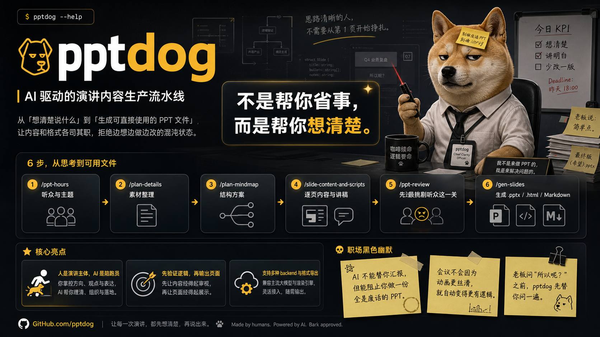

# pptdog

## 为什么叫 pptdog？

在职场里，做 PPT 是一种隐形的消耗——不是因为内容难，而是因为你在用本该思考的时间去排版、调字号、对齐框框。这是一种黑色幽默：明明是去分享想法的，结果变成了给 PPT 当狗。

**我不想当狗。让 AI 当。**

所以叫 pptdog。

---

## 市面上已经有一堆生成 PPT 的了，为什么还要做？

因为它们都在解决错误的问题。

那些工具在解决「怎么让 PPT 好看」，而好不好看从来不是演讲失败的真正原因。真正的问题是：**内容不行**。

- 说的东西听众早就知道了
- 论点没有逻辑，靠排列堆砌
- 没有真实案例，全是泛泛而谈
- 说了很多，但听众不知道你想让他们记住什么

pptdog 想解决的就是这个问题——在你打开任何 PPT 工具之前，先把内容想清楚。

如果流程用下来你觉得有启发，那这个启发不只是「怎么做 PPT」，而是**一套把想法结构化、可表达的思维方式**。

---

## 一句话

**pptdog 是一个 AI 驱动的演讲内容生产流水线**：从「想清楚说什么」到「生成可直接使用的 PPT 文件」，每一步都有对应的 Skill 护航，内容和格式各司其职，拒绝边想边做边改的混沌状态。

---

## 设计哲学

> **好的分享，应该让自己也有启发。**

pptdog 不是帮你「省事」的工具，而是帮你「想清楚」的工具。

准备分享的过程，本质上是一次**有压力的深度思考**：
- 你必须把因果关系说清楚
- 你必须找到真实的案例，而不是泛泛而谈
- 你必须想清楚「为什么这样做，而不是那样做」

这些思考，会让你自己比听众受益更多。

pptdog 的每一步都在逼你做这件事：

| 步骤 | 逼你思考什么 |
|------|------------|
| /ppt-hours | 我说的东西，听众真的不知道吗？ |
| /plan-details | 我的素材够不够？有没有真实案例？ |
| /plan-mindmap | 我的论点之间有真正的逻辑关系吗？ |
| /slide-content-and-scripts | 我能不靠读 PPT 把这些讲出来吗？ |
| /ppt-review | 如果我是最挑剔的听众，这个分享打几分？ |

---

## 完整流程图

```
┌──────────────────────────────────────────────────────────────────────────────┐
│                         pptdog 完整生产流水线                                 │
│                                                                              │
│  /ppt-hours                                                                  │
│  ├── 搞清楚：我在对谁说？我想说什么？什么该说、什么不该说？                        │
│  └── 输出：ppt-hours.md（听众画像 + 一句话主题）                                │
│          │                                                                   │
│          ▼                                                                   │
│  /plan-details                                                               │
│  ├── 把原始素材整理清楚，按分类（证据/思考结论/行动）构建关联关系                 │
│  └── 输出：details.md（素材库 + 关联关系）                                      │
│          │                                                                   │
│          ▼                                                                   │
│  /plan-mindmap                                                               │
│  ├── 基于 details.md 提供 2-3 个有差异的结构方案，讲者确认                        │
│  └── 输出：mindmap.md（分享骨架/大纲）                                          │
│          │                                                                   │
│          ▼                                                                   │
│  /slide-content-and-scripts                                                  │
│  ├── 把 details.md 转化为每页 Slide 内容规划 + 演讲口头说（含开门关门/图片引用）  │
│  └── 输出：slide-content.md（完整内容稿，格式化为逐页结构）                       │
│          │                                                                   │
│          ▼                                                                   │
│  /ppt-review         ← ★ 生成前最后一道关                                     │
│  ├── AI 扮演最挑剔的听众，三层九项打分（听得进/记得住/有启发）                     │
│  ├── 均分 ≥ 7 才放行，否则输出必须修改项                                        │
│  └── 输出：review.md（评审报告）                                               │
│          │                                                                   │
│          ▼                                                                   │
│  /gen-slides         ← ★ 内容转格式，唯一生成文件的步骤                         │
│  ├── 执行内容规则（字数检查 / 标题论点化 / 图示占位）                             │
│  ├── 扫描环境中已安装的 PPT 生成工具，让用户选择 backend                         │
│  ├── 把 slide-content.md 适配为对应格式，调用所选工具生成文件                    │
│  └── 输出：slides/deck.pptx（或 .html，取决于所选 backend）                    │
└──────────────────────────────────────────────────────────────────────────────┘
```

---

## 每个 Skill 一句话说明

| Skill | 触发命令 | 一句话说明 |
|-------|---------|----------|
| PPT Hours | `/ppt-hours` | 演讲前的战略思考：搞清楚听众、主题和断舍离边界 |
| Plan Details | `/plan-details` | 整理原始素材（证据/思考结论/行动），构建关联关系，作为结构设计的血肉 |
| Plan Mindmap | `/plan-mindmap` | 基于整理好的素材库，提供 2-3 个结构方案，讲者选一个作为分享骨架 |
| Slide Content and Scripts | `/slide-content-and-scripts` | 把 details.md 转化为每页 Slide 内容规划 + 演讲口头说，包含开门关门、小开关门、图片引用 |
| PPT Review | `/ppt-review` | 生成前最后一道关：AI 扮演最挑剔的听众，三层九项打分 |
| Gen Slides | `/gen-slides` | 调度层：扫描环境中已安装的 PPT 生成工具，让用户选择 backend，把内容稿适配后传给对应工具生成文件 |

---

## 三种入口：怎么开始？

### 🟢 入口 A：零起步（什么都没有，只有一个想法）

```
1. 运行 /ppt-hours
   → AI 帮你问清楚：场合是什么？听众是谁？想说什么？
   → 输出听众画像 + 一句话主题

2. 运行 /plan-details
   → AI 帮你把脑子里的原始素材梳理清楚，构建关联关系

3. 运行 /plan-mindmap
   → AI 基于梳理好的素材，提供 2-3 个结构方案，你选一个

4. 运行 /slide-content-and-scripts
   → 内容稿出炉

5. 运行 /ppt-review
   → 评审内容，不达标不放行

6. 运行 /gen-slides
   → 生成 .pptx 文件
```

### 🟡 入口 B：有大纲（有思维导图或粗略 outline）

```
1. 运行 /ppt-hours [大纲文件路径]
   → AI 分析大纲，帮你确认听众和主题聚焦

2. 运行 /plan-mindmap
   → 在你的大纲基础上优化结构

（后续步骤同入口 A 的 3-6）
```

### 🔵 入口 C：有素材（有草稿/旧 PPT/文章/报告）

```
1. 运行 /ppt-hours [素材文件路径]
   → AI 读取素材，提取候选主题，帮你断舍离

2. 运行 /plan-details
   → 对已有内容深化、提取素材库，方便后续验证或重组

3. 运行 /plan-mindmap
   → 若素材结构需要重组，由 AI 提供新的逻辑方案

（后续步骤同入口 A 的 4-6）
```

> **核心原则：** 每个入口最终都必须经过 `/ppt-review` 才能进入 `/gen-slides`。
> 内容不达标，不生成文件——这是 pptdog 的质量底线。

---

## 文件系统结构

```
~/.pptdog/
├── learnings.jsonl              # 全局 learnings（跨项目的历史踩坑记录）
├── templates/                   # PPT 模板目录（可选）
│   ├── default/                 # pptdog 默认模板
│   └── <自定义模板名>/
└── projects/
    └── <slug>/                  # 每个演讲对应一个独立项目目录
        ├── ppt-hours.md         # 听众画像 + 一句话主题（/ppt-hours 输出）
        ├── details.md           # 素材血肉与关联关系（/plan-details 输出）
        ├── mindmap.md           # 分享骨架/大纲（/plan-mindmap 输出）
        ├── slide-content.md     # 完整内容稿，逐页结构（/slide-content-and-scripts 输出）
        ├── review.md            # 内容评审报告（/ppt-review 输出）
        ├── timeline.jsonl       # 项目事件时间线（各 Skill 追加写入）
        ├── learnings.jsonl      # 项目级 learnings（可选，优先写全局）
        └── slides/
            ├── deck.pptx        # 生成的 PPT 文件（/gen-slides 输出）
            └── deck-with-notes.pptx  # 带演讲者备注版（可选）
```

**设计原则：**
- 所有状态在文件系统上，Skill 本身无状态
- learnings.jsonl 只追加不修改，天然可审计
- 每个项目目录完全独立，可以 zip 打包归档
- 文件命名与 Skill 名对应，一眼知道从哪来

---

## 方法论来源

pptdog 的评审框架和内容方法论来自：

- **「听得进 / 记得住 / 有启发」** 三层框架 — 分享型演讲方法论
- **「成果举证 / 证明自己 / 展现牛」** — 汇报型演讲方法论
- **金字塔原理 / 一波三折 / MECE** — 结构化思维工具
- **F.A.B 法则（Feature → Advantage → Benefit）** — 内容筛选工具
- **空姐效应** — PPT 上不写你会读的文字

详见 [`METHODOLOGY.md`](./METHODOLOGY.md)。

---

## 安装方式

> ⚠️ 安装脚本待完善，以下为占位说明。

### 前置依赖

`/gen-slides` 本身不生成 PPT，它是一个调度层，把 `slide-content.md` 适配后交给你环境中已安装的工具来生成文件。支持的 backend 如下（任选一种安装即可）：

| Backend | 安装方式 | 输出格式 | 适合场景 |
|---------|---------|---------|---------|
| **html-ppt-designer** ⭐ 推荐 | [GitHub](https://github.com/andyhuo520/html-ppt-designer) 或在 AI 编辑器中安装 skill | `.html`（浏览器直接演示） | 不依赖 PPT 软件，视觉效果无损耗 |
| **pptx skill** | 在 Claude Code / CodeBuddy 等中安装 `pptx` skill | `.pptx` | 支持 .pptx 模板，保留母版/配色/字体 |
| **NanoBanana PPT Skills** | [GitHub](https://github.com/op7418/NanoBanana-PPT-Skills) | `.pptx` | 参考图驱动风格，效果好 |
| **python-pptx** | `uv pip install python-pptx` 或 `pip install python-pptx` | `.pptx` | 无需额外 skill，速度快，样式较简单 |
| **Marp CLI** | `npm install -g @marp-team/marp-cli` | `.pptx` / `.html` | 技术演讲，代码多，Markdown 流 |
| **结构化 Markdown** | 无需安装 | `.md` | 导入 Gamma / Google Slides / Canva 等工具 |

> 💡 `/gen-slides` 运行时会自动检测环境中已安装的工具，列出可用选项让你选择。未安装任何 backend 时，至少可以导出结构化 Markdown。

### 安装 pptdog Skills

```bash
# 方式一：克隆仓库后手动注册（待实现）
git clone https://github.com/your-org/pptdog ~/.openclaw/workspace/pptdog
# 将 skills/ 目录中的各 SKILL.md 注册到 OpenClaw

# 方式二：通过 Knot Skills 安装（待上架）
# /knot-skills install pptdog
```

### 初始化项目目录

```bash
mkdir -p ~/.pptdog/projects
mkdir -p ~/.pptdog/templates
touch ~/.pptdog/learnings.jsonl
```

安装完成后，直接输入 `/ppt-hours` 开始你的第一个演讲。

---

## 常见问题

**Q：我只是想快速出一个 PPT，能不能跳过前面几步？**  
A：可以，但 pptdog 的核心价值在「/ppt-review」这道关。最短路径是：直接写好 `slide-content.md`，然后跑 `/ppt-review` + `/gen-slides`。跳过前面的步骤，内容质量由你自己负责。

**Q：/ppt-review 未通过，但我时间紧，能强制生成吗？**  
A：可以，`/gen-slides` 会警告但不阻塞。时间是你的，决定权也是你的。

**Q：能用我们公司的 PPT 模板吗？**  
A：可以。在 `/gen-slides` Step 1 选「使用我的公司模板」，提供 `.pptx` 模板文件路径即可。

**Q：learnings 是什么？有什么用？**  
A：learnings 是跨会话的历史踩坑记录。每次评审发现的问题都会追加写入，下次运行 Skill 时会自动加载，提醒你「上次在这种场景下踩过这个坑」。随着使用次数增加，AI 会越来越了解你的演讲习惯。
�惯。
